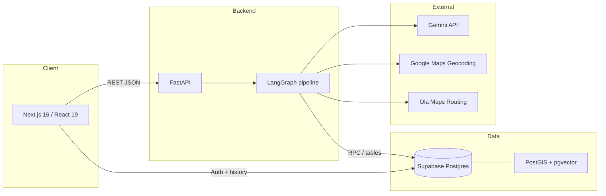
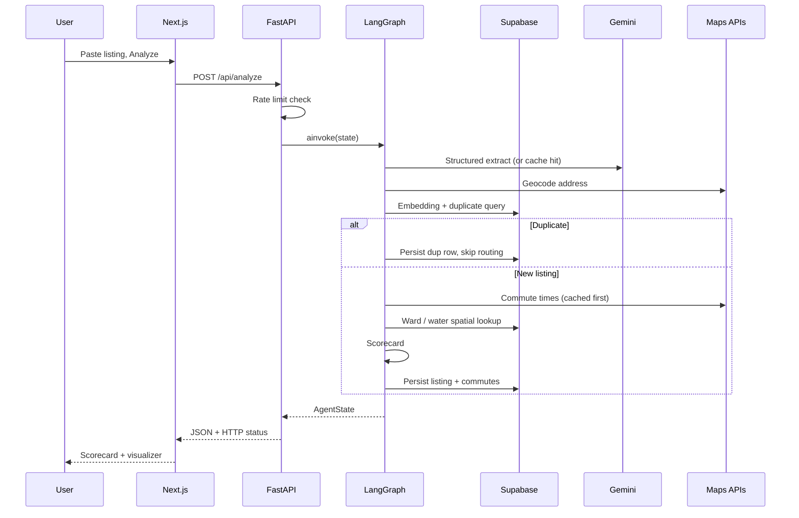
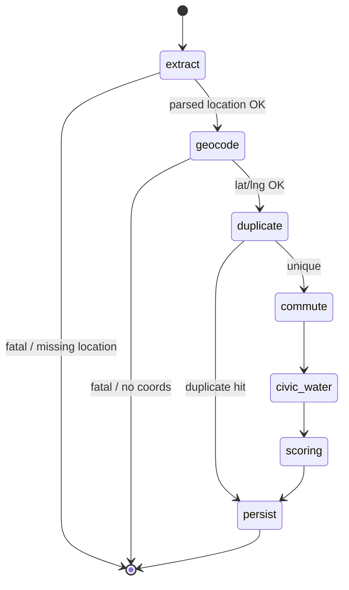
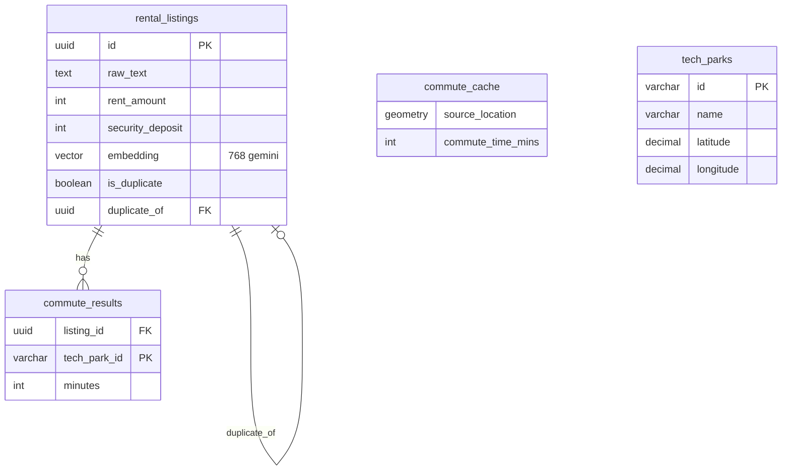

# Namma Bengaluru Rental Reality-Check

**An end-to-end Gen AI + geospatial pipeline** that turns messy Bengaluru rental listings (Telegram blurbs, broker copy-paste, informal text) into a structured record and a **100-point Livability Scorecard**—commute realism, water risk, deposit fairness, and civic context—using **LLM structured extraction**, **vector similarity deduplication**, **PostGIS**, and **real routing APIs**.

This repository is intended as a **portfolio piece**: it shows how you can combine **LangGraph orchestration**, **Google Gemini** (generation + embeddings), **Supabase (PostGIS + pgvector)**, and **external maps APIs** into a coherent product loop with caching, rate limits, and production-minded failure modes—not a toy chat wrapper.

---

## Table of contents

- [What this project demonstrates](#what-this-project-demonstrates)
- [User-facing features](#user-facing-features)
- [System architecture](#system-architecture)
- [LangGraph pipeline (deep dive)](#langgraph-pipeline-deep-dive)
- [Livability scoring model](#livability-scoring-model)
- [Data & persistence](#data--persistence)
- [Tech stack](#tech-stack)
- [Frontend: TanStack Query (server-state cache)](#frontend-tanstack-query-server-state-cache)
- [Getting started](#getting-started)
- [API reference](#api-reference)
- [Optional: Telegram ingestion](#optional-telegram-ingestion)
- [Operations: quotas, retention, keep-alive](#operations-quotas-retention-keep-alive)
- [Repository layout](#repository-layout)
- [Further reading](#further-reading)

---

## What this project demonstrates

| Area | What the code does |
|------|---------------------|
| **LLM as ETL, not chat** | Gemini turns unstructured listing text into a strict `RentalListingSchema` (rent, deposit, BHK, location, gender/restrictions, **water-related booleans** from natural language). |
| **Orchestration** | A **LangGraph** `StateGraph` wires nodes with **conditional edges** (bail on bad extract/geocode, short-circuit on duplicates). |
| **RAG-adjacent patterns** | **pgvector** cosine similarity + **500 m PostGIS radius** to detect broker spam duplicates without naive string equality. |
| **Geo + AI fusion** | Coordinates drive **Ola Maps** commute times (with **PostGIS commute cache** + Haversine fallback), and **ward-level water/civic** lookups (OpenCity-derived GBA data). |
| **Reliability** | Per-node timeouts, **fatal vs best-effort** nodes, **60 s pipeline ceiling**, partial success paths, structured errors in state. |
| **Cost & abuse** | Prompt/extraction DB cache, Gemini throttle, commute concurrency cap, anonymous vs authenticated **rate limits**. |

---

## User-facing features

- **Analyze** — Paste a listing; the UI calls `/api/analyze` and renders a **pipeline visualizer**, parsed fields, map context, commute breakdown, and **Livability Scorecard**.
- **Auth (Supabase)** — Optional login; authenticated users get higher daily limits and **search history** (`/history`, detail pages). History list responses are **cached with TanStack Query** so revisiting `/history` does not refetch on every navigation while data is fresh.
- **HTTP semantics** — Response status codes map to terminal pipeline status (e.g. timeout → 504) so clients can branch without parsing JSON.

---

## System architecture

High-level view: **Next.js** talks to **FastAPI**; FastAPI runs a **LangGraph** pipeline that calls **Gemini**, **Google Geocoding**, **Ola Maps**, and **Supabase** (Postgres + PostGIS + pgvector).



### Request path (analyze listing)



---

## LangGraph pipeline (deep dive)

The graph is built in `backend/app/graph/pipeline.py` and compiled once. **Conditional routing** avoids burning APIs when extraction or geocoding fails, and **skips** commute/civic/scoring when a **semantic duplicate** is detected (scores come from the canonical row).



### Node responsibilities

| Order | Node | Role |
|-------|------|------|
| 1 | **extract** | Gemini `gemini-2.5-flash-lite` + `with_structured_output(RentalListingSchema)`. Checks **SQL-backed extraction cache** (`prompt_cache` / versioned prompt). Throttled via `llm_throttle`. **Fatal**: bad parse stops the graph. |
| 2 | **geocode** | Resolves `raw_location` to coordinates (see `backend/app/services/geocoding.py`—Google Maps with Bengaluru bounds + progressive string stripping; city-center fallback). **Fatal** if unusable. |
| 3 | **duplicate** | `GoogleGenerativeAIEmbeddings` → 768-d vector; Supabase query combines **cosine distance** (threshold **0.92**) with **500 m** radius. Rebuilds scorecard from matched row when dup. |
| 4 | **commute** | Loads `data/processed/tech_parks.json`, fetches each park’s drive time via `get_commute_time` (**PostGIS cache RPC first**, then Ola; Haversine heuristic on failure). **Best-effort** (partial commutes allowed). |
| 5 | **civic_water** | `get_ward_data_async` — GBA ward, corporation, Cauvery stage, groundwater risk. Fuzzy fallback on listing text if ward stage unknown. **Best-effort**. |
| 6 | **scoring** | Computes **LivabilityScorecard** (see below). **Best-effort** but usually runs if prior steps left enough state. |
| 7 | **persist** | Writes `rental_listings`, `commute_results`, metadata; always reached on non-fatal paths (including duplicates). |

Outer wrapper: `asyncio.wait_for(..., 60s)` — on breach, returns structured **`timeout`** state and HTTP **504**.

---

## Livability scoring model

Implemented in `backend/app/graph/nodes/scoring_node.py` (and mirrored for history/detail in `main.py`). Total **100 points**:

| Component | Max points | Logic (summary) |
|-----------|------------|-----------------|
| **Commute** | 40 | Uses **average of best 2** tech-park drive times (realistic for dual-income / roommate scenarios). Buckets: ≤30 min avg → 40 pts; ≤45 → 25; ≤60 → 10; else 0. |
| **Water** | 35 | Composite from ward **Cauvery stage**, **groundwater risk**, and **listing-level signals** (Cauvery/BWSSB mentions, borewell, 24×7, RWH, tankers)—see `backend/app/graph/nodes/_water_scoring.py`. |
| **Financial** | 15 | Security deposit vs rent in **months**: ≤3 mo → 15 pts; ≤6 → 5; else 0 + red flag. |
| **Civic** | 10 | **BBMP Central / South** emphasis → 10; other in-GBA corporations → 5; outside / unknown → 0. |

If the **total score is below 50**, the scorecard adds suggested alternative neighborhoods (static hints in code).

---

## Data & persistence

Core schema lives in `database/schema.sql` with incremental migrations under `database/migrations/`.



Notable engineering choices (also documented in `docs/ARCHITECTURE.md`):

- **Embeddings stripped from API JSON** — `_OMIT_KEYS` in `main.py` avoids shipping ~768 floats to the browser.
- **90-day prune trigger** — inserts trigger `prune_old_listings()` to protect Supabase free-tier storage with pgvector-heavy rows.
- **Normalized commutes** — `commute_results` child table avoids JSON column migrations when adding parks.

---

## Tech stack

| Layer | Technology |
|-------|------------|
| **Frontend** | Next.js **16**, React **19**, TypeScript, [**TanStack Query**](https://tanstack.com/query/latest) (cached `/api/listings/history`), Supabase JS client (auth) |
| **Backend** | Python **≥3.11**, FastAPI, Uvicorn, Pydantic v2 |
| **Orchestration** | **LangGraph** + LangChain Google GenAI integrations |
| **LLM / embeddings** | **Google Gemini** (chat + `gemini-embedding-001` default) |
| **Database** | **Supabase** = Postgres + **PostGIS** + **pgvector** |
| **Maps** | Google Maps Geocoding, Ola Maps Directions (with spatial cache + heuristic fallback) |
| **Ingestion (optional)** | Telethon script → `POST /api/analyze` |
| **CI** | GitHub Actions keep-alive cron (`.github/workflows/supabase-keepalive.yml`) |

---

## Frontend: TanStack Query (server-state cache)

Search **history** is loaded from `GET /api/listings/history`. Without a cache, every visit to `/history` would refetch. The app uses [**TanStack Query (React Query)**](https://tanstack.com/query/latest) for that **server state**: in-memory cache, deduplication, and explicit invalidation—not Redux (which is a better fit for complex **client**-only global state).

| Topic | What we do |
|--------|------------|
| **Provider** | `frontend/src/components/AppProviders.tsx` wraps the tree with `QueryClientProvider` **outside** `AuthProvider` so auth code can call `useQueryClient()` (e.g. on sign-out). Root layout uses `<AppProviders>`. |
| **Defaults** | `staleTime: 5m`, `gcTime: 30m`, `refetchOnWindowFocus: false`, `retry: 1` on the shared `QueryClient`. |
| **History query** | `frontend/src/app/history/page.tsx` uses `useQuery` with key `listingsHistoryQueryKey(user.id)` from `frontend/src/lib/listingsHistory.ts`. While data is **fresh**, navigating away and back to History does **not** call the API again. |
| **Invalidate after a new audit** | `frontend/src/app/analyze/page.tsx` calls `queryClient.invalidateQueries({ queryKey: listingsHistoryQueryKeyRoot })` when the pipeline returns a **saved listing id** and the user is logged in, so the vault picks up the new row on the next History visit (or background refetch). |
| **Clear on sign-out** | `frontend/src/components/AuthContext.tsx` removes all `['listings', 'history', …]` queries so the next user never sees the previous account’s list. |

To add more cached API reads later: define a small `fetch*` in `frontend/src/lib/`, use `useQuery` with a stable key, and `invalidateQueries` wherever the server data changes.

---

## Getting started

### Prerequisites

- Node.js 20+ (matches typical Next 16 setup)
- Python 3.11+
- [uv](https://github.com/astral-sh/uv) (recommended) or pip
- Supabase project with SQL applied
- API keys (see `.env.example`)

### 1. Clone and environment

```bash
git clone https://github.com/<your-org>/Namma-bengaluru-reality-check.git
cd Namma-bengaluru-reality-check
cp .env.example .env
# Edit .env: GEMINI_*, GOOGLE_MAPS_*, OLA_MAPS_*, SUPABASE_*, etc.
```

### 2. Database

In the Supabase SQL editor (or `psql`), run in order:

1. `database/schema.sql`
2. All files in `database/migrations/` (numeric order)
3. `database/seed_tech_parks.sql`

Ensure extensions **postgis** and **vector** are enabled (included in schema).

### 3. Backend

```bash
cd backend
uv sync   # or: pip install -e .
uv run uvicorn app.main:app --reload --host 0.0.0.0 --port 8000
```

The app loads `.env` from the **repo root** (`../.env` relative to `backend/app/main.py`).

### 4. Frontend

```bash
cd frontend
npm install
npm run dev
```

Default dev URLs: frontend `http://localhost:3000`, API `http://localhost:8000`. The analyze page posts to `http://localhost:8000/api/analyze`—adjust if you deploy or use a proxy.

### 5. Processed data

Commute node expects **`data/processed/tech_parks.json`** at the repo root (same coordinates as `database/seed_tech_parks.sql`). If that file is missing, the commute step returns an empty map and scoring adds *“Commute data unavailable; score defaulted to 0.”* Keep the JSON in sync when you change park destinations. Optional: set `OLA_MAPS_API_KEY` for routed times; without it, drive times use a Haversine + average-speed heuristic.

---

## API reference

| Method | Path | Auth | Description |
|--------|------|------|-------------|
| `GET` | `/api/health` | No | Liveness; used by keep-alive workflow |
| `POST` | `/api/analyze` | Optional Bearer | Runs full pipeline; records `user_searches` when authenticated |
| `GET` | `/api/listings/history` | Required | Paginated search history |
| `GET` | `/api/listings/{id}` | Required | Full listing + reconstructed scorecard (403 if user never analyzed that id) |

**Rate limits (current implementation)**

- **Anonymous**: 1 analyze per IP per day (in-memory counter; resets UTC midnight).
- **Authenticated**: up to **5** analyzes per user per day (counted in `user_searches`).

**HTTP status ↔ pipeline**

- `200` — `success`, `partial`, or `duplicate`
- `504` — `timeout`
- `502` — `failed`
- `429` — rate limit exceeded

---

## Optional: Telegram ingestion

`backend/ingestion/telegram_listener.py` uses **Telethon** to listen on configurable public channels and POST raw text to `/api/analyze` with `source_platform: "telegram"`.

Requires `TELEGRAM_API_ID`, `TELEGRAM_API_HASH`, `TELEGRAM_PHONE` in `.env`. Run as a separate long-lived process alongside the API.

---

## Operations: quotas, retention, keep-alive

- **Gemini / maps quota** — Extraction cache, `throttle("gemini")`, commute **cache-first** RPC, bounded concurrency (`_OLA_CONCURRENCY = 3`), per-leg timeouts.
- **Supabase free tier pause** — Workflow pings `BACKEND_URL/api/health` and Supabase REST on a **5-day** cron; configure repo secrets `BACKEND_URL`, `SUPABASE_URL`, `SUPABASE_ANON_KEY`.
- **Storage** — Automatic pruning of listings older than **90 days** on insert (see `prune_old_listings` in `database/schema.sql`).

---

## Repository layout

```
├── backend/
│   ├── app/
│   │   ├── main.py              # FastAPI routes, rate limits, JSON shaping
│   │   ├── graph/
│   │   │   ├── pipeline.py      # LangGraph definition + run_pipeline
│   │   │   └── nodes/           # extract, geocode, duplicate, commute, civic_water, scoring, persist
│   │   ├── models/schemas.py    # Pydantic: AgentState, RentalListingSchema, LivabilityScorecard
│   │   └── services/            # geocoding, routing, spatial, cache, supabase, water_data, llm_throttle
│   └── ingestion/               # Telegram listener
├── data/
│   └── processed/               # tech_parks.json (commute destinations; tracked in git)
├── database/
│   ├── schema.sql
│   ├── migrations/
│   └── seed_tech_parks.sql
├── docs/
│   ├── ARCHITECTURE.md
│   └── BACKEND_AI_BEGINNER_INTERVIEW_GUIDE.md
├── frontend/
│   └── src/
│       ├── app/                 # analyze, login, history routes
│       ├── components/          # AppProviders (QueryClient + Auth), Navigation, …
│       └── lib/                 # e.g. listingsHistory.ts (fetch + query keys)
└── .github/workflows/
```

---

## Data attribution

- **Bengaluru ward boundaries & water signals**: [OpenCity.in](https://opencity.in/) (processed into app spatial layers / water DB—see ingestion and migration comments in-repo).

---

## Author note

This project is a **deliberate full-stack Gen AI sample**: structured outputs, embeddings at scale, graph-based control flow, spatial joins, and honest handling of **partial failure** and **cost**. If something here aligns with your team’s stack (Gemini, LangGraph, Supabase, Next), the author would welcome a conversation.

---

*Built to run largely on free-tier friendly services; production hardening (secrets management, stricter CORS, Redis-backed rate limits) would be the next step for a public SaaS.*
